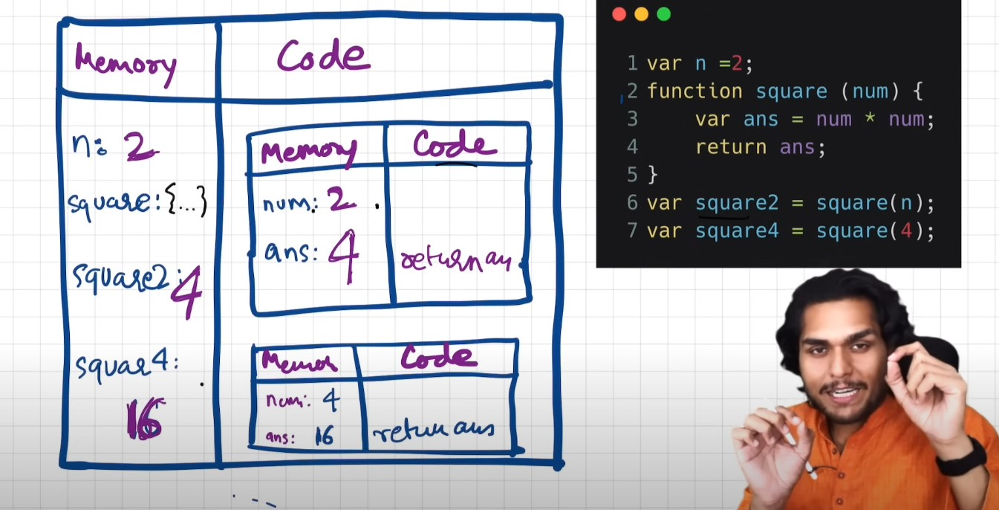

<h1>Basics of JavaScript</h1>

1. Everything in JS happens inside an <b><i>Execution Context</i></b>.

2. Exceution Context :-
     Its consists of two compoenents :-  
     

        i) <b>Memory Component</b> :- Also known as Variable Environment. Its stores variables and functions as key : value pairs.
               
        ii) <b>Code Component</b> :- Also known as Thread of Execution. Where the code is executed line by line.
     

3. JS is a synchronus single-threaded language.

4. When we run a code a global execution context is created. Execution context is created in two phases :-  
     i) <b>Memory Creation Phase</b> : It allocates memory to different variables & functions. For vaiables it stores undefined while for function its stores the code.
         
     ii) <b>Code Execution Phase</b> : Runs through the whole js program line by line. Here the value of variables are assigned in memory.

5. Everytime a funtion is called it creates a execution context.

6. Return keyword tells the function to return the control back where it is invoked.

7. Whole execution context will be deleted after execution of a function or program.

8. Js manages all the execution context using call stack and global execution context is at the bottom of the stack.

9. Call stack maintains the order of execution contexts.

10. Call Stack is also called : 

