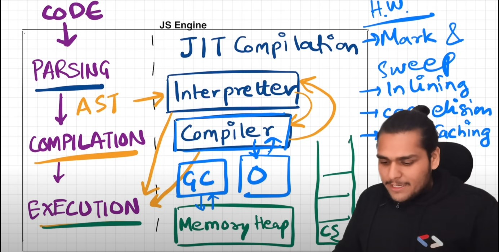

<h1>JS Engine</h1>

- JS runtime environment contains all elements required to run JS.

- It contains JS engine, set of API's, callback queue, microtask queue, event loop.

- JS engine is a piece of code.

- Process includes Parsing ---> Compilation -----> Execution.

- Parsing breaks code into tokens and converts it into AST(Abstract Syntax Tree).

- Modern JS engine follows JIT compilation, it interprets while it optimises code as much as it can.

- Execution and Compilation are done together.

- Execution has Garbage collector and other optimisation such as inlining, copy elusion, inline caching etc.

<b>Mark Sweep Algorithm</b> :

- Basic idea about Mark & Sweep Algo:

- It comprise of 2 phases -  
      1. Mark phase  
      2. Sweep phase  

- All objects are marked as 0 initially (at creation) and in mark phase the objects that will be accessible are marked as 1 (reachable) by a DFS graph traversal.

- During sweep phase, the objects marked with 0 are removed from heap memory. and also all reachable objects are again initialized with 0 (made unreachable) because the algorithm will run again.

- So, it's basically tracing garbage collector concept. :)

