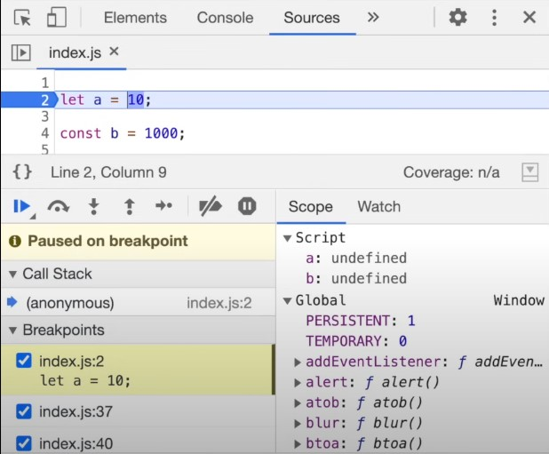

<h1><u>let</u> <u>&</u> <u>const</u></h1>
<p>

- let & const declarations are Hoisted.

<code>Example 1 :-</code>

```javascript
console.log(b)
console.log(a)
let a = 10;
var b = 100;
```

<code>Output :-</code>

```
undefined
Uncaught ReferenceError: Cannot acces 'a' before initialization.
```

<code>Example 2 :-</code>

```javascript
let a = 10;
console.log(a)
var b = 100;
```

<code>Output :-</code>

```
10
```

<code>Example 3 :-</code>

```javascript
console.log(x)
let a = 10;
var b = 100;
```

<code>Output :-</code>

```
Uncaught ReferenceError: x is not defined.
```

<code>Example 4 :-</code>

```javascript
let a = 10;
let a = 100;
```

<code>Output :-</code>

```
Uncaught SyntaxError: Indentifier 'a' has already been declared.
```

- const and let are hoisted in different memory space.

<code>Example 5 :-</code>

```javascript
let a = 10;
const b = 100;
```



<code>Example 6 :-</code>

```javascript
let a;
a = 10;
console.log(a)
const b;
b = 1000;
```

<code>Output :-</code>

```
Uncaught SyntaxError: Missing initializer in const declaration.
```

<code>Example 7 :-</code>

```javascript
let a = 1000;
a = 10;
console.log(a)
const b;
b = 1000;
```

<code>Output :-</code>

```
Uncaught TypeError: Assignment to constant variable.
```

<b><u>Temporal</u> <u>Dead</u> <u>Zone</u></b> :

- Time between a variable is declared and initialized (From hoisting till it is assigned a value).

- <b>3 types of Error</b> : <br>
   - Reference Error <br>
   - Type Error <br>
   - Syntax Error <br>

- To avoid temporal dead zone write all the initialization and declaration at the top.

- "let & const are Block Scoped".

- Block is defined by {....}. Also known as compound statement. We wrap multiple statement into a group where Js expects only a single statement.

- Block scope is what all variables we can access inside a block. 

- If we have same named variable in block scope and in global scope, then which ever is declared later overshadows the other.

</p>